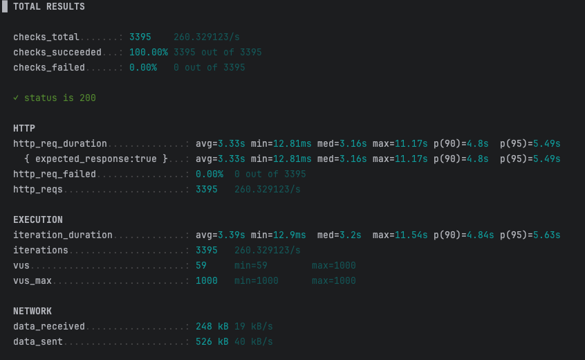
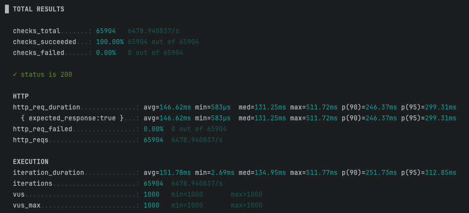
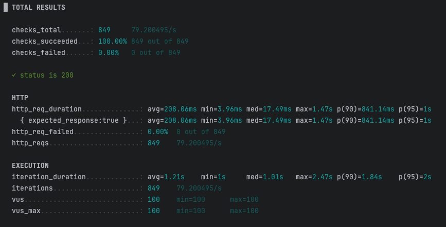
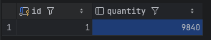
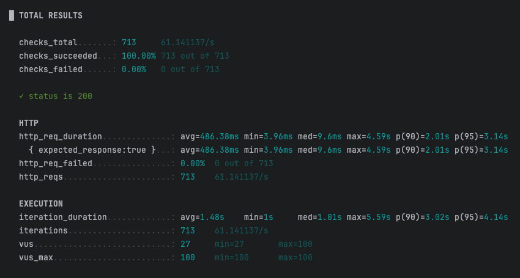
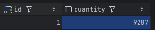
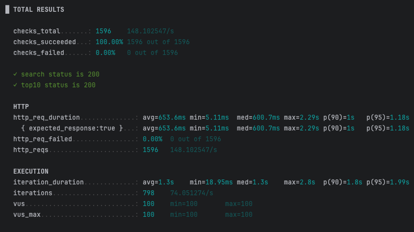
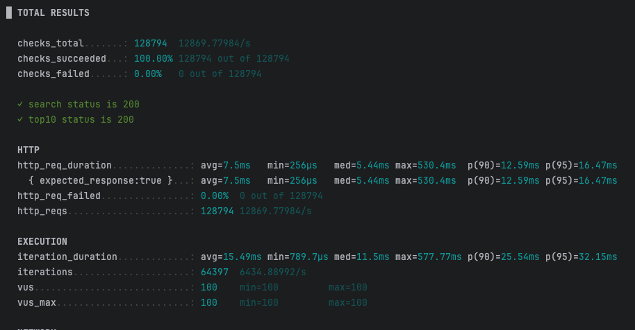

## 문제상황 및 해결책

### script_1-1 결과 (개선 전)

| 지표 | 값 |
|---|---|
| avg 응답시간 | 3.33s |
| p(95) 응답시간 | 5.49s |
| TPS | 260/s |
| 실패율 | 0% |

### script_1-2 결과 (개선 후)

| 지표 | 값 |
|---|---|
| avg 응답시간 | 146.62ms |
| p(95) 응답시간 | 299.31ms |
| TPS | 6,479/s |
| 실패율 | 0% |

----
## 문제상황
### script_2-1 결과 (동시성 문제 발생)

| 지표 | 값 |
|---|---|
| checks 성공률 | 100% (849/849) |
| avg 응답시간 | 208.06ms |
| p(95) 응답시간 | 1s |
| max 응답시간 | 1.47s |
| TPS | 79.2/s |
| VUs | 100 |

**수량 결과**

> 초기 수량 10,000개에서 849건의 감소 요청을 보냈으므로 예상 수량은 9,151개. 하지만 실제로는 9,840개가 남아 **689건의 감소분이 유실됨

### script_2-2 결과 (Redis 락 적용 후)

| 지표 | 값 |
|---|---|
| checks 성공률 | 100% (713/713) |
| avg 응답시간 | 486.38ms |
| p(95) 응답시간 | 3.14s |
| max 응답시간 | 4.59s |
| TPS | 61.1/s |
| VUs | 27 (min) ~ 100 (max) |

**수량 결과**

> 초기 수량 10,000개에서 713건의 감소 요청을 보냈고, 예상 수량(9,287개)과 실제 수량이 정확히 일치 → Redis `SETNX` 기반 락으로 동시성 문제가 해결됨을 확인

----
### script_3-1 결과 (개선 전)

| 지표 | 값 |
|---|---|
| checks 성공률 | 100% (1,596/1,596) |
| avg 응답시간 | 653.6ms |
| p(95) 응답시간 | 1.18s |
| max 응답시간 | 2.29s |
| TPS | 148.1/s |
| VUs | 100 |

### script_3-2 결과 (Redis ZSET 적용 후)

| 지표 | 값 |
|---|---|
| checks 성공률 | 100% (128,794/128,794) |
| avg 응답시간 | 7.5ms |
| p(95) 응답시간 | 16.47ms |
| max 응답시간 | 530.4ms |
| TPS | 12,869.78/s |
| VUs | 100 |

> 검색어 카운트 증가를 DB 조회+저장 대신 Redis `ZINCRBY`로, Top10 조회를 DB 정렬 쿼리 대신 `ZRANGE ... REV`로 대체 → avg 응답시간 약 87배, TPS 약 87배 개선